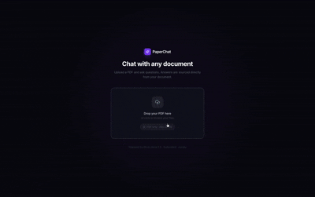

# PaperChat



Chat with any PDF using AI. Upload a research paper, textbook, or report and ask questions about it. Answers are sourced directly from your document with citations.

**Live demo → [paper-chat-five.vercel.app](https://paper-chat-five.vercel.app)**

---

## What it does

1. Upload a PDF
2. PaperChat extracts the text, splits it into chunks, and embeds each chunk into a vector space
3. When you ask a question, it finds the most semantically relevant chunks and passes them to an LLM
4. The LLM answers using only information from your document, with source citations

This is called **RAG (Retrieval-Augmented Generation)** — a core pattern in production AI systems.

---

## Tech stack

| Layer | Technology | Why |
|---|---|---|
| Frontend | Next.js 14 (App Router) | React framework with built-in routing and API rewrites |
| Styling | Tailwind CSS | Utility-first, fast to iterate |
| Backend | FastAPI (Python) | Async-native, auto-generates API docs, great for streaming |
| LLM | Groq — Llama 3.3 70B | ~800 tokens/sec inference, free tier available |
| Embeddings | fastembed (ONNX) | Lightweight alternative to PyTorch, fits in 512MB RAM |
| Vector search | NumPy cosine similarity | No database overhead — exact search on in-memory matrix |
| PDF parsing | pdfplumber | Handles real-world messy PDFs better than PyPDF2 |
| Text splitting | LangChain splitter | Overlapping chunks preserve context across boundaries |
| Frontend hosting | Vercel | Auto-deploys from GitHub, global CDN |
| Backend hosting | Render | Free tier Python web service |

---

## Architecture

```
Browser (Vercel)
    │
    │  Upload PDF → POST /upload
    │  Ask question → POST /chat (SSE stream)
    │
    ▼
FastAPI Backend (Render)
    │
    ├── /upload
    │     ├── pdfplumber      → extract text
    │     ├── LangChain       → split into overlapping chunks
    │     ├── fastembed ONNX  → embed each chunk (384-dim vectors)
    │     └── NumPy store     → save embeddings in memory
    │
    └── /chat
          ├── fastembed       → embed the question
          ├── NumPy           → cosine similarity search → top 4 chunks
          ├── Groq SDK        → stream answer from Llama 3.3 70B
          └── SSE             → stream tokens to browser in real-time
```

**Why bypass Vercel's proxy for uploads?**
Vercel's serverless functions have a ~30s timeout. Embedding a full research paper takes longer on Render's free tier (slow CPU). The frontend calls the Render backend directly using `NEXT_PUBLIC_BACKEND_URL`, skipping the proxy entirely.

---

## Running locally

### Prerequisites
- Node.js 18+
- Python 3.10+
- [Groq API key](https://console.groq.com) (free)

### Backend

```bash
cd backend
python -m venv venv
source venv/bin/activate      # Windows: venv\Scripts\activate
pip install -r requirements.txt

cp .env.example .env
# Add your GROQ_API_KEY to .env

python main.py
# → http://localhost:8000
# → API docs: http://localhost:8000/docs
```

**macOS SSL fix** (Python 3.12 from python.org):
```bash
/Applications/Python\ 3.12/Install\ Certificates.command
```

### Frontend

```bash
npm install
npm run dev
# → http://localhost:3000
```

---

## Project structure

```
paperchat/
├── app/                    # Next.js App Router pages
│   ├── layout.tsx          # Root layout, mesh gradient background
│   └── page.tsx            # Main page — switches between upload/chat views
├── components/
│   ├── FileUpload.tsx      # Drag-and-drop upload with pipeline progress steps
│   ├── ChatWindow.tsx      # Chat UI with auto-summary and streaming
│   ├── MessageBubble.tsx   # Inline markdown renderer (bold, bullets, citations)
│   └── SourceCitation.tsx  # Collapsible source chunks with relevance scores
├── lib/
│   ├── api.ts              # All fetch() calls — upload, streamChat, health check
│   └── types.ts            # TypeScript interfaces
└── backend/
    ├── main.py             # FastAPI app, CORS, lifespan (model preload)
    ├── requirements.txt
    ├── core/
    │   ├── ingestion.py    # PDF → text → chunks
    │   ├── embeddings.py   # fastembed singleton (BAAI/bge-small-en-v1.5)
    │   ├── vectorstore.py  # In-memory numpy vector store with cosine search
    │   └── llm.py          # Groq async streaming, system + user prompt builders
    └── routers/
        ├── upload.py       # POST /upload, DELETE /documents/:id
        └── chat.py         # POST /chat (SSE), GET /health
```

---

## Key concepts

**Chunking with overlap** — Documents are split into ~1000 character chunks with 200 character overlap. Overlap prevents answers from being cut off at chunk boundaries.

**Embeddings** — Each chunk is converted to a 384-dimensional vector using `BAAI/bge-small-en-v1.5`. Semantically similar text produces similar vectors regardless of the exact words used.

**Cosine similarity** — At query time, the question is embedded and compared to all chunk vectors using dot product (since vectors are L2-normalized). Top 4 most similar chunks are retrieved.

**Streaming with SSE** — The LLM response streams token-by-token using Server-Sent Events. The frontend reads the stream with `ReadableStream` and appends tokens to the UI in real-time.

---

## Deployment

- **Backend**: [Render](https://render.com) — Python web service, free tier
  - Set `GROQ_API_KEY` in environment variables
  - Build: `pip install -r requirements.txt`
  - Start: `uvicorn main:app --host 0.0.0.0 --port $PORT`

- **Frontend**: [Vercel](https://vercel.com) — import from GitHub
  - Set `BACKEND_URL` = your Render URL (for Next.js rewrites)
  - Set `NEXT_PUBLIC_BACKEND_URL` = your Render URL (for direct browser calls)

---

Built by [Vikram Varkoor](https://www.linkedin.com/in/vikram-varkoor/)
